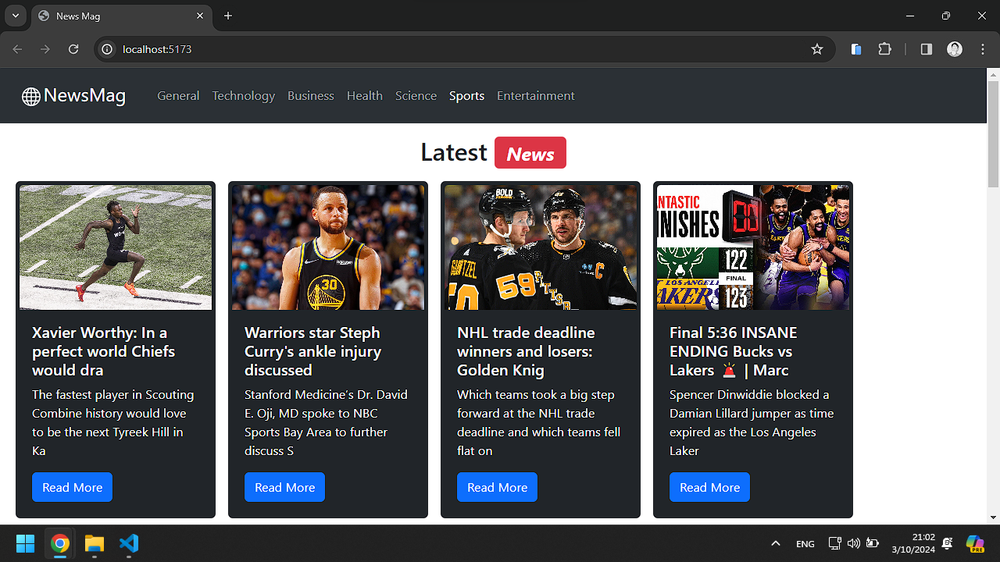

# Deskripsi

News Mag adalah website yang menyediakan berita dari berbagai negara. News Mag bertujuan untuk menjadi sumber berita yang terpercaya dan terkini bagi para pembaca. Platform ini menyajikan berita dari berbagai kategori, termasuk teknologi, bisnis, kesehatan, sains, olahraga, hiburan, dan masih banyak lagi :v :v :v :v. Website ini dibuat pakai Reaksi Javascript (React.js) :v dan aku pakai Vite untuk create-react-app-nya.

## Framework

- Minecraft 💎🪨⛏
- React.js ⚛️
- Bootstrap 🅱

## Getting Started

Pertama kamu harus punya npm/pnpm ya, baru jalankan kode di bawah ini di terminal kamu

1. Clone repository
   ```
   git clone https://github.com/faridrawing/news-mag.git
   ```
2. Buka direktori repository
   ```
   cd news-mag
   ```
3. Instal package(s) yang dibutuhkan
   - NPM:
   ```
   npm install
   ```
   - PNPM:
   ```
   pnpm install
   ```
4. Jalankan aplikasi dalam mode development
   - NPM:
   ```
   npm run dev
   ```
   - PNPM:
   ```
   pnpm run dev
   ```
5. Build aplikasi (opsional)
   - NPM:
   ```
   npm run build
   ```
   -  PNPM:
   ```
   pnpm run build
   ```

## Dokumentasi


